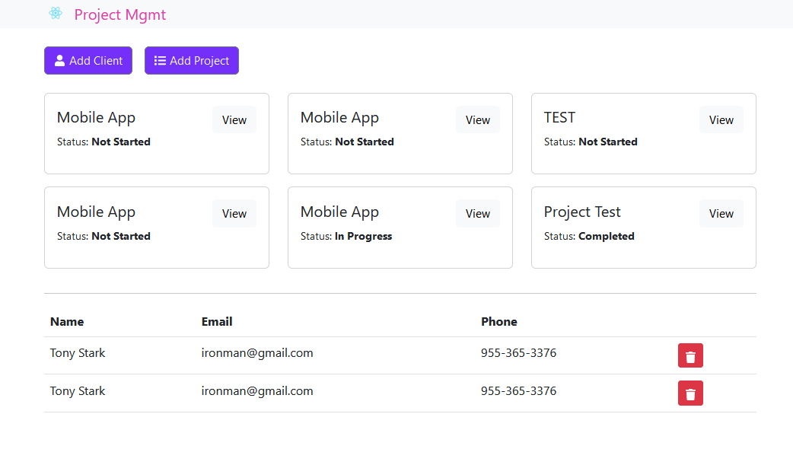

# MERN stack q/ GraphQL ##
Simple project/client management application with some basic CRUD queries.

Foundation was inspired by [Traversy Media](https://github.com/bradtraversy/project-mgmt-graphql "Traversy Media") and built upon it.

### Getting started
1. Download the repository
2. ` npm i` packages in client/server
3. Run `nodemon server.js` & `npm start`.

